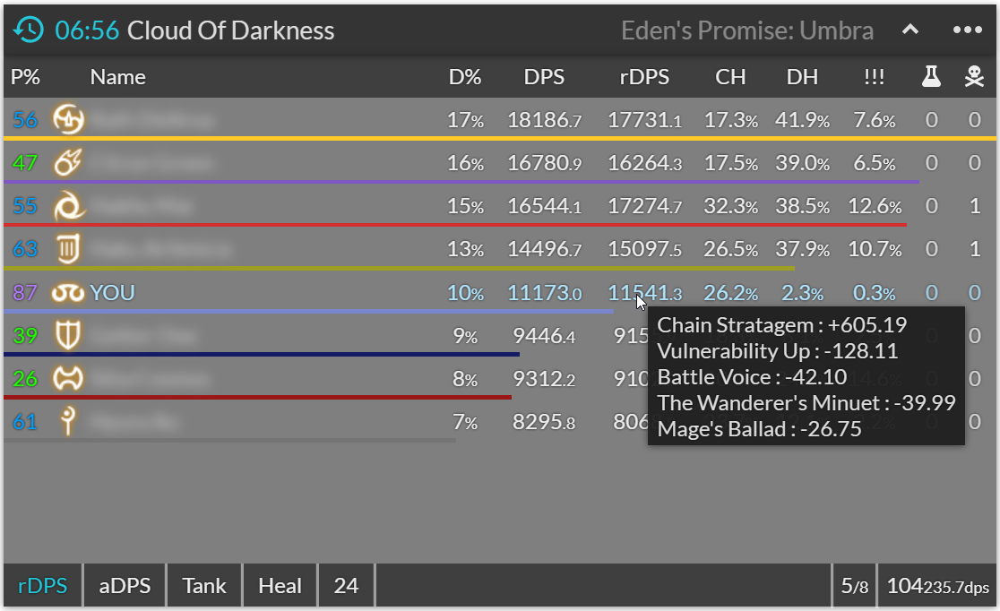

# custom kagerou
An ACT-OverlayPlugin skin of customized [kagerou](https://github.com/hibiyasleep/kagerou). (Thank you [hibiyasleep](https://github.com/hibiyasleep) and [contributers](https://github.com/hibiyasleep/kagerou/graphs/contributors)!!)

Displays additional information provided by [FFXIV_ACT_Helper_Plugin](https://github.com/ugabugab/ffxiv-act-helper-plugin).

## Features / Screenshots

* kagerou 0.8.5 based
* Displays the number of times using Medicated item
* Displays simulated FFLogs rDPS/aDPS, Parse % and DPS portions (given/taken DPS)

see [kagerou](https://github.com/hibiyasleep/kagerou) for more details.

## Required plugins
* [ravahn / FFXIV_ACT_Plugin](https://github.com/ravahn/FFXIV_ACT_Plugin)
* [ugabugab / FFXIV_ACT_Helper_Plugin](https://github.com/ugabugab/ffxiv-act-helper-plugin)
* [ngld / OverlayPlguin](https://github.com/ngld/OverlayPlugin)

## Usage
1. Add above required plugins to your ACT.
2. Create new overlay on OverlayPlugin.dll tab with this settings:
   - Name : `Any (e.g. custom-kagerou)`
   - Preset : `Custom`
   - Type : `MiniParse`
3. Set this as overlay URL:
   > `https://ugabugab.github.io/custom-kagerou/overlay`

## License
GPLv3.
